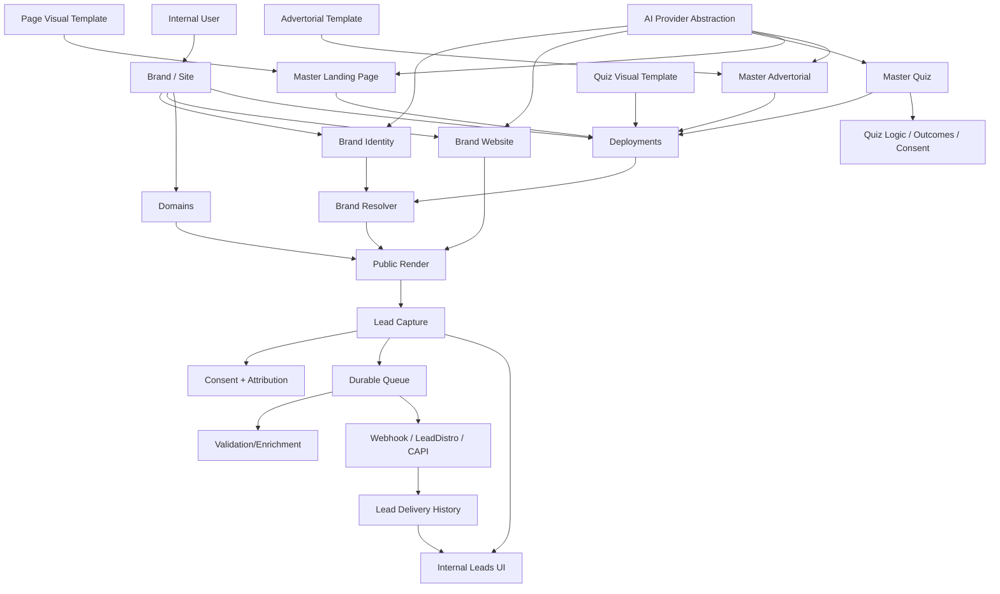

# Context graph

## Context isolation rules

- Lead/consent data remains scoped to Brand/Site and organization access rules.
- Master asset content may be reused across Brands without carrying Brand-private Lead data.
- Deployment can reference a reusable master but must not copy unrelated tenant data.
- Brand Website is Brand-owned, not a global reusable master by default.
- AI must not receive Lead PII unless a specific approved feature requires it.
