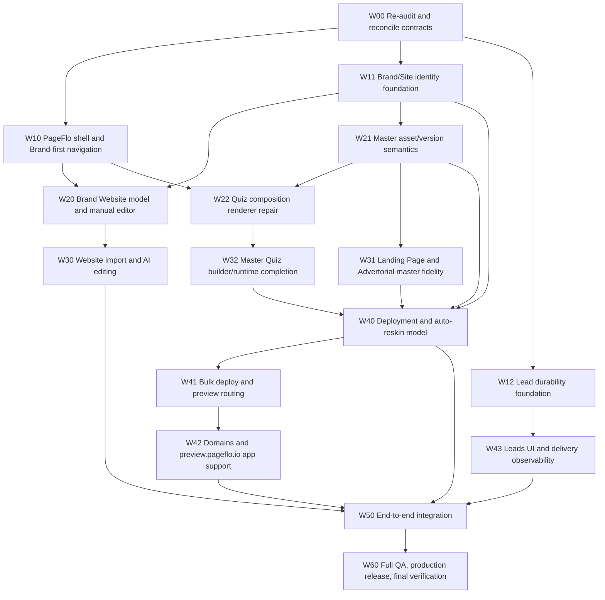

# Work graph

## Critical path

## Parallel lanes

After W00:

- UI/design lane: W10
- Brand/data lane: W11
- Lead backend lane: W12

After Brand foundation:

- Website lane: W20/W30
- Master/template lane: W21/W31
- Quiz lane: W22/W32

Deployment integration W40 begins only when Brand, master semantics, Landing/Advertorial, and Quiz contracts are stable enough to bind.

## Likely bottleneck

The biggest bottleneck is the reusable master plus deployment renderer boundary, especially template fidelity and versioning without breaking current live deployments.
